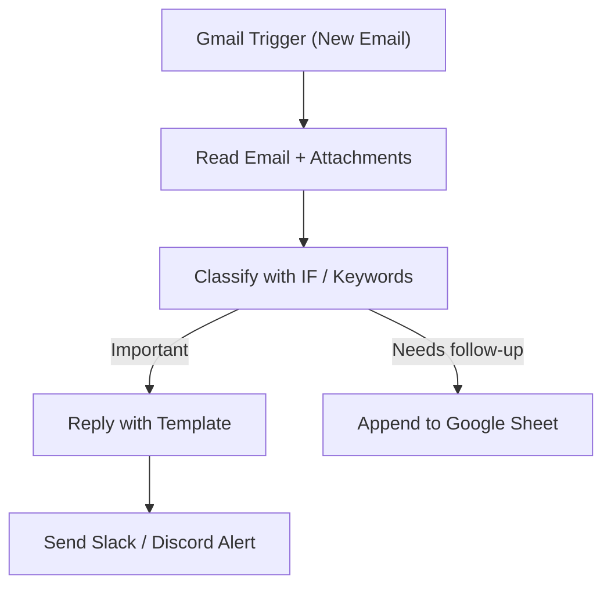

# 01 - Gmail Inbox Processor & Auto-Responder

Processes incoming Gmail, classifies mail, auto-responds to common queries and logs follow-ups to Google Sheets. Runs locally for free.

## Architecture Diagram



## Key Nodes

| Node | Purpose |
|------|---------|
| Gmail Trigger | Fires on new/unread email |
| Gmail (Read) | Fetches body, sender, subject |
| IF / Code | Classifies into categories |
| Gmail (Send) | Sends template replies |
| Google Sheets | Logs every email + action |
| Slack/Discord | Notifies on VIP emails |

## Build & Run

```bash
# Build the image
docker build -t n8n-gmail-inbox .

# Run on Docker Desktop
docker run -d --name n8n-gmail -p 5678:5678 \
  -v ~/.n8n:/home/node/.n8n n8n-gmail-inbox
```

## Docker Compose (optional)

```yaml
services:
  n8n-gmail:
    image: n8n-gmail-inbox
    container_name: n8n-gmail
    restart: unless-stopped
    ports: ["5678:5678"]
    volumes: ["n8n_gmail_data:/home/node/.n8n"]

volumes:
  n8n_gmail_data:
```

Cost: $0 — Gmail via OAuth app credentials (free tier), local storage, unlimited runs.
