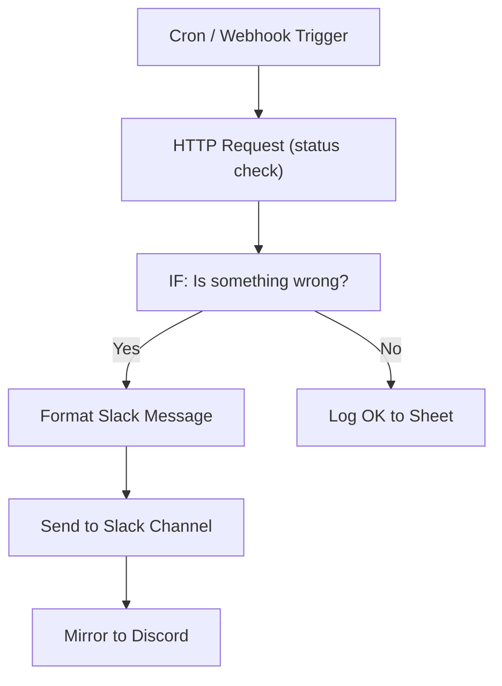

# 02 - Slack Team Alert & Notification System

Aggregates alerts from monitoring, forms and payments, then routes them to the correct Slack channel with a Discord mirror.

## Architecture Diagram



## Key Nodes

| Node | Purpose |
|------|---------|
| Cron Trigger | Check every 5 minutes |
| HTTP Request | Poll service/API health |
| IF | Decide if alert is needed |
| Slack | Post to channels/@mentions |
| Discord (community) | Mirrors critical alerts |
| Google Sheets | Audit log of every check |

## Build & Run

```bash
docker build -t n8n-slack-alerts .
docker run -d --name n8n-slack -p 5678:5678 \
  -v ~/.n8n:/home/node/.n8n n8n-slack-alerts
```

Cost: $0 — Slack workspace itself is free, alerts run locally.
