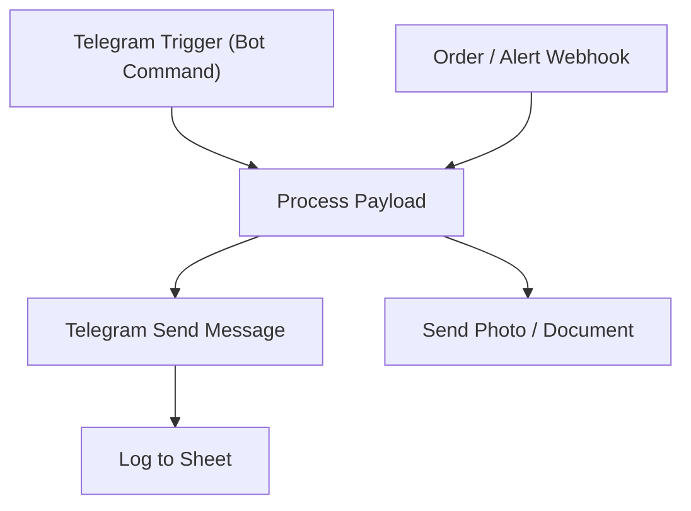

# 03 - Telegram Message & Notification Bot

Sends order updates, alerts and daily digests to Telegram using the community Telegram nodes.

## Architecture Diagram



## Key Nodes

| Node | Purpose |
|------|---------|
| Telegram Trigger | Listens for bot commands |
| Webhook | Receives external events |
| Set / IF | Builds message content |
| Telegram Send | Text messages to users/channels |
| Telegram Photo | Sends charts, images, files |
| Google Sheets | Logs all messages sent |

## Build & Run

```bash
docker build -t n8n-telegram-bot .
docker run -d --name n8n-telegram -p 5678:5678 \
  -v ~/.n8n:/home/node/.n8n n8n-telegram-bot
```

Set your bot token in the workflow credentials (or the `TELEGRAM_BOT_TOKEN` env var).

Cost: $0 — Telegram Bot API is free, unlimited messages.
