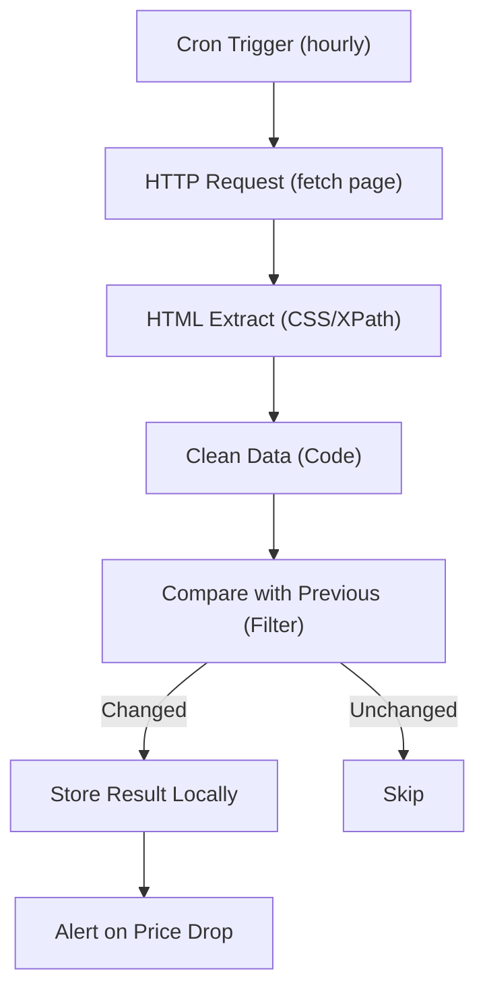

# 04 - Web Scraper & Data Extraction

Scrapes public pages on a schedule, extracts structured fields, detects changes and stores results locally.

## Architecture Diagram



## Key Nodes

| Node | Purpose |
|------|---------|
| Cron Trigger | Schedule scraper runs |
| HTTP Request | Downloads the page |
| HTML Extract | Pulls elements via selectors |
| Code | Cleans/normalizes fields |
| Filter | Detects meaningful changes |
| Spreadsheet File | Local CSV/JSON storage |
| Telegram/Slack | Alerts when threshold hit |

## Build & Run

```bash
docker build -t n8n-web-scraper .
docker run -d --name n8n-scraper -p 5678:5678 \
  -v ~/.n8n:/home/node/.n8n n8n-web-scraper
```

Scrape only sites you own or have permission to scrape.

Cost: $0 — no paid scraping API required.
