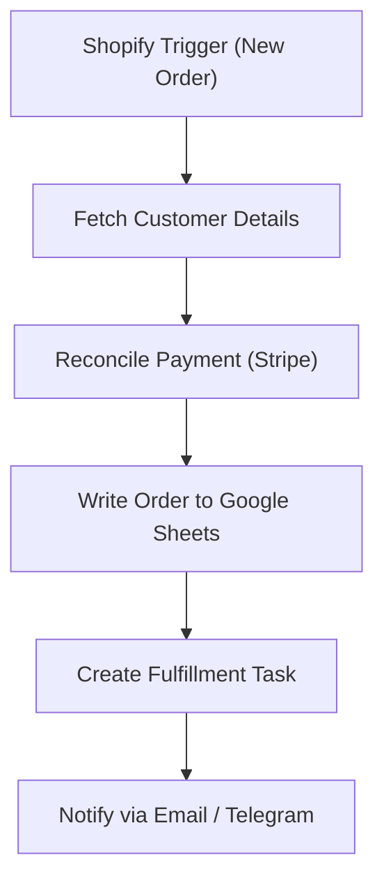

# 05 - E-commerce Order Sync (Shopify to Google Sheets)

Watches Shopify for new orders, enriches with customer data, syncs to Google Sheets and reconciles payments via Stripe.

## Architecture Diagram



## Key Nodes

| Node | Purpose |
|------|---------|
| Shopify Trigger | New order / updated order |
| Shopify Customer | Pulls buyer info |
| Stripe (community) | Matches payments/refunds |
| Google Sheets | Live order ledger |
| HTTP / Slack | Fulfillment notifications |
| Email (SMTP) | Order confirmation to ops |

## Build & Run

```bash
docker build -t n8n-shopify-order-sync .
docker run -d --name n8n-shopify -p 5678:5678 \
  -v ~/.n8n:/home/node/.n8n n8n-shopify-order-sync
```

Cost: $0 — Shopify API is included in your store plan; automation runs locally.
