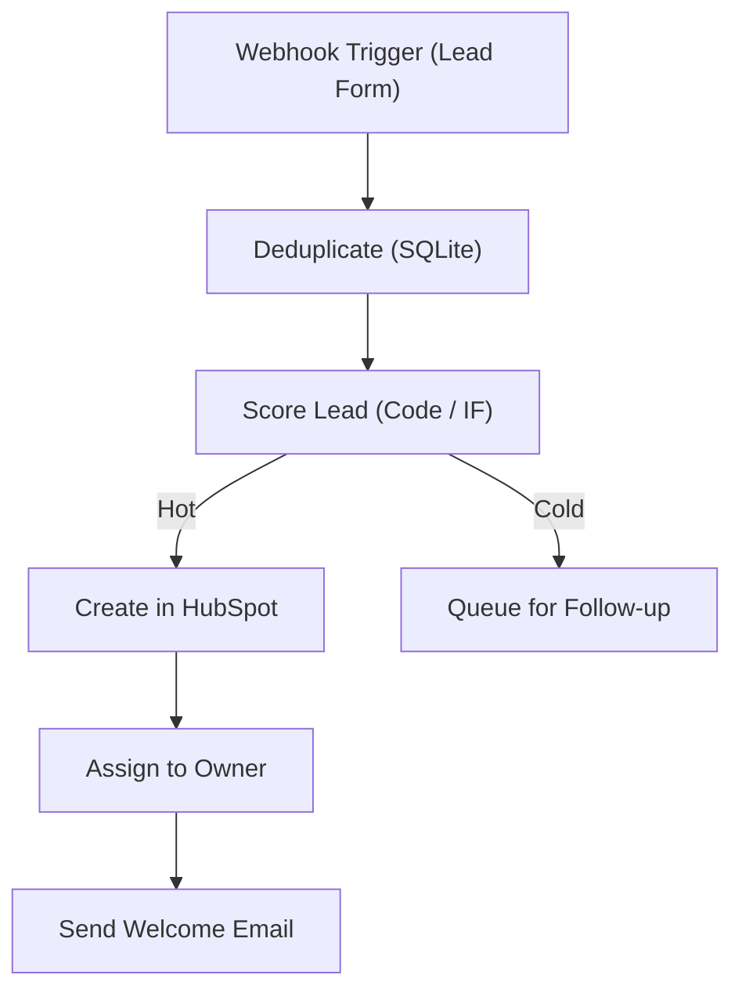

# 06 - CRM Lead Capture & Smart Distribution

Captures leads from a landing page webhook, deduplicates, scores and distributes them to the right HubSpot owner with a local SQLite queue.

## Architecture Diagram



## Key Nodes

| Node | Purpose |
|------|---------|
| Webhook | Receives form submissions |
| SQLite (community) | Dedup + lead queue |
| Code | Computes lead score |
| HubSpot | Create/update contacts |
| HubSpot | Assign owner by region |
| Email | Welcome sequence |

## Build & Run

```bash
docker build -t n8n-crm-leads .
docker run -d --name n8n-crm -p 5678:5678 \
  -v ~/.n8n:/home/node/.n8n n8n-crm-leads
```

Cost: $0 — HubSpot free CRM tier + local n8n.
