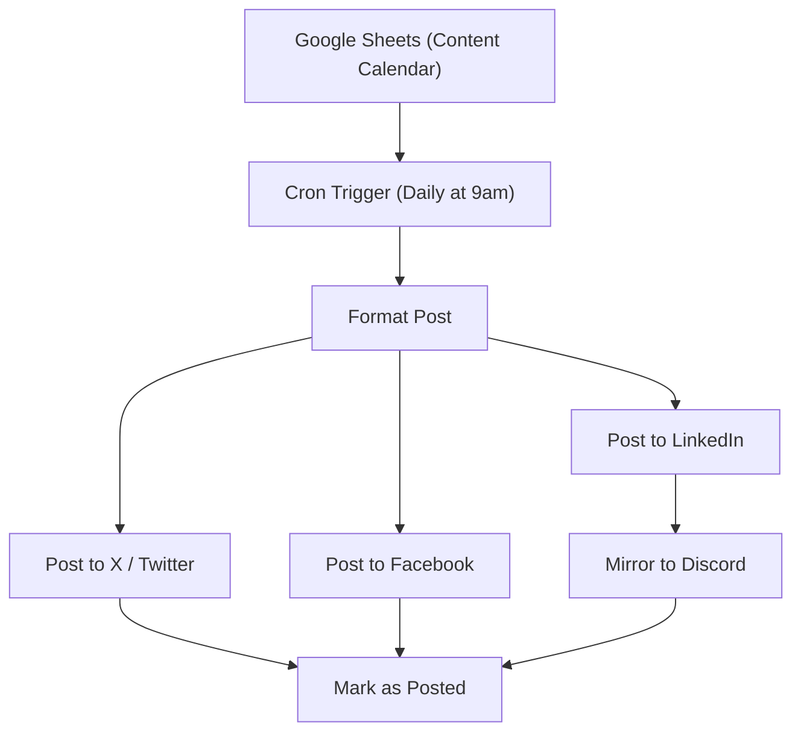

# 07 - Social Media Content Scheduler

Builds a weekly content calendar and auto-posts to X (Twitter), Facebook and LinkedIn, with a Discord mirror.

## Architecture Diagram



## Key Nodes

| Node | Purpose |
|------|---------|
| Cron Trigger | Runs at scheduled times |
| Google Sheets | Reads the content calendar |
| X / Twitter | Publish tweets |
| Facebook | Publish posts |
| LinkedIn | Publish articles |
| Discord (community) | Channel mirror |
| Spreadsheet | Marks rows as posted |

## Build & Run

```bash
docker build -t n8n-social-scheduler .
docker run -d --name n8n-social -p 5678:5678 \
  -v ~/.n8n:/home/node/.n8n n8n-social-scheduler
```

Cost: $0 — free API tiers for Twitter/X, Facebook and LinkedIn.
