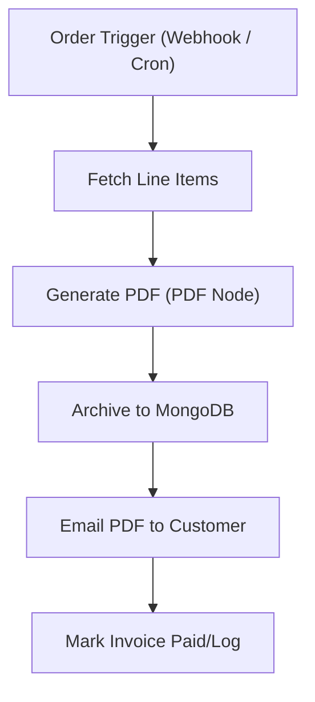

# 08 - PDF Invoice Generator & Delivery

Turns order data into branded PDF invoices, archives them in MongoDB and emails them to customers.

## Architecture Diagram



## Key Nodes

| Node | Purpose |
|------|---------|
| Webhook / Cron | Starts on new order |
| HTTP Request | Gets order details |
| PDF Generator | Renders branded PDF |
| MongoDB (community) | Invoice archive |
| Email (SMTP) | Sends invoice attachment |
| Google Sheets | Delivery status log |

## Build & Run

```bash
docker build -t n8n-invoice-generator .
docker run -d --name n8n-invoice -p 5678:5678 \
  -v ~/.n8n:/home/node/.n8n n8n-invoice-generator
```

Cost: $0 — PDF generation is local, email via free SMTP.
