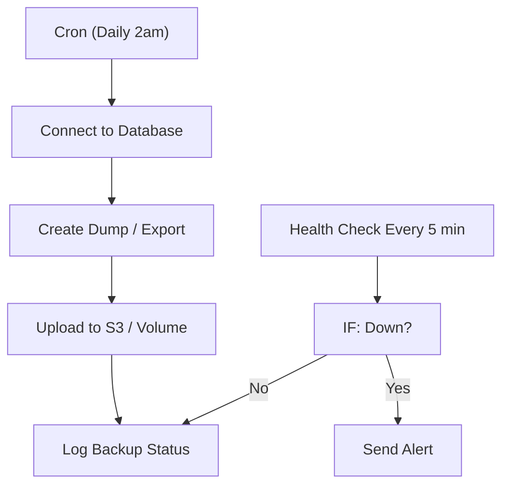

# 09 - Database Backup & Uptime Monitor

Schedules automated database backups, stores them in S3/local volumes and alerts the team when a service is down.

## Architecture Diagram



## Key Nodes

| Node | Purpose |
|------|---------|
| Cron Trigger | Backup schedule |
| MySQL / Postgres | Dump databases |
| MongoDB (community) | Backup MongoDB collections |
| S3 / Local Volume | Store dumps |
| HTTP Request | Health checks |
| IF | Detect downtime |
| Slack / Email | Notify on failure |

## Build & Run

```bash
docker build -t n8n-db-monitor .
docker run -d --name n8n-dbmon -p 5678:5678 \
  -v ~/.n8n:/home/node/.n8n n8n-db-monitor
```

Cost: $0 — local backups, S3-compatible free tiers available.
