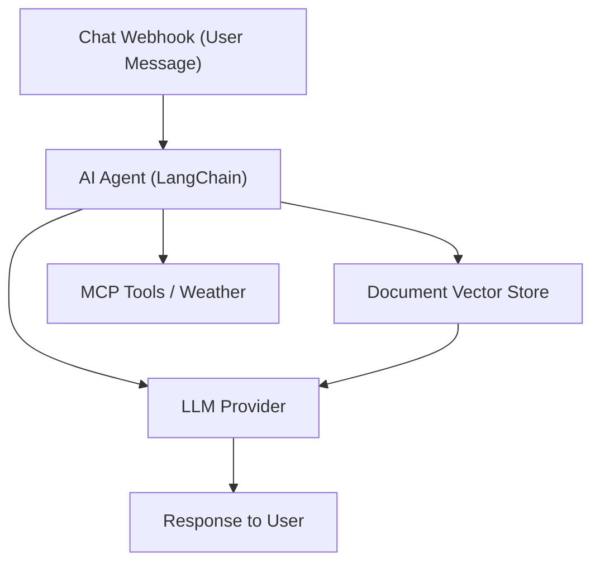

# 10 - AI / LLM Powered Chat Assistant

Connects n8n's LangChain AI agent to a local LLM endpoint, exposes a webhook chat, answers from your documents and calls tools (weather, MCP).

## Architecture Diagram



## Key Nodes

| Node | Purpose |
|------|---------|
| Webhook | Receives chat messages |
| AI Agent | Decides tool calls / replies |
| Vector Store | RAG over your documents |
| LLM (OpenAI/Local) | Generates answers |
| MCP (community) | Model-Context-Protocol tools |
| OpenWeatherMap | Live data tool |

## Build & Run

```bash
docker build -t n8n-ai-chatbot .
docker run -d --name n8n-ai -p 5678:5678 \
  -v ~/.n8n:/home/node/.n8n n8n-ai-chatbot
```

Bring your own LLM API key (or use a free local model like Ollama).

Cost: $0 base — LLM inference cost depends on your provider.
