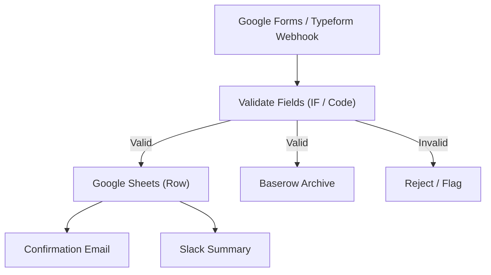

# 11 - Web Form Data Pipeline (Forms to Sheets/Base)

Receives form submissions, validates fields, writes rows to Google Sheets, stores originals in Baserow and sends confirmation emails.

## Architecture Diagram



## Key Nodes

| Node | Purpose |
|------|---------|
| Webhook | Form submission trigger |
| IF / Code | Required-field validation |
| Google Sheets | Store clean rows |
| Baserow (community) | Self-hosted database UI |
| Email | Send confirmation |
| Slack | Daily submissions summary |

## Build & Run

```bash
docker build -t n8n-form-pipeline .
docker run -d --name n8n-forms -p 5678:5678 \
  -v ~/.n8n:/home/node/.n8n n8n-form-pipeline
```

Cost: $0 — Google Forms, Sheets and local Baserow are free.
