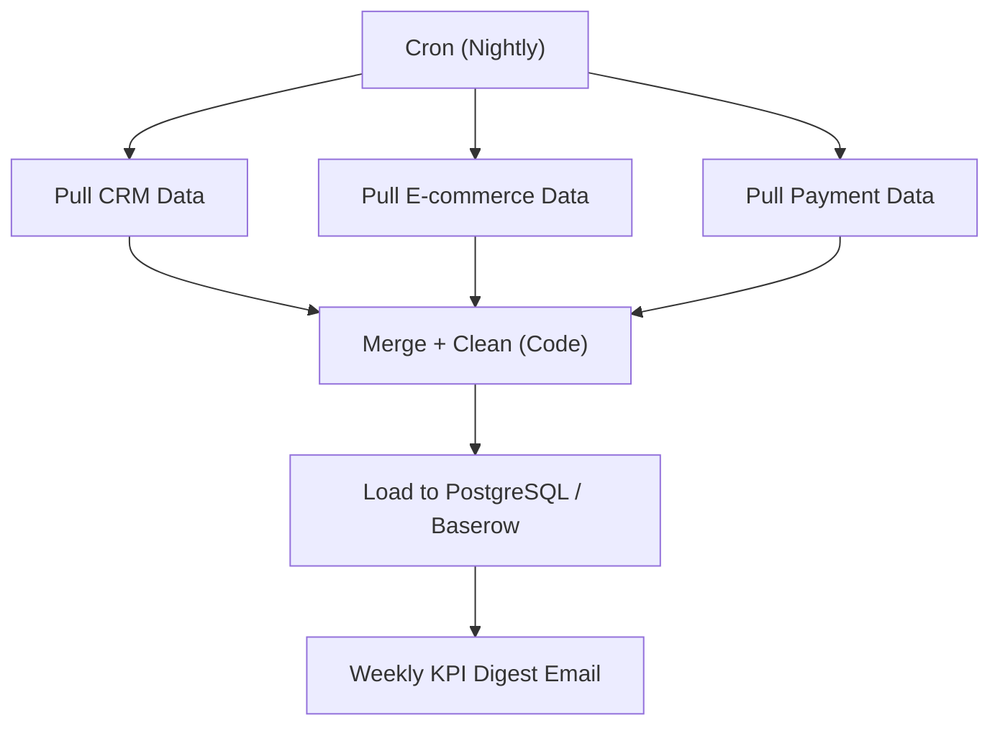

# 12 - Sales Analytics & BI Pipeline

Aggregates sales data from CRM, e-commerce and payments, transforms it, loads it to Postgres/Baserow and emails a weekly KPI digest.

## Architecture Diagram



## Key Nodes

| Node | Purpose |
|------|---------|
| Cron Trigger | Nightly pipeline run |
| HTTP / CRM | Extract sources |
| Merge + Code | Join and clean data |
| PostgreSQL | Analytics warehouse |
| Baserow (community) | Low-code BI tables |
| Email | KPI digest to stakeholders |

## Build & Run

```bash
docker build -t n8n-sales-pipeline .
docker run -d --name n8n-sales -p 5678:5678 \
  -v ~/.n8n:/home/node/.n8n n8n-sales-pipeline
```

Cost: $0 — Postgres is open source, pipeline runs locally.
