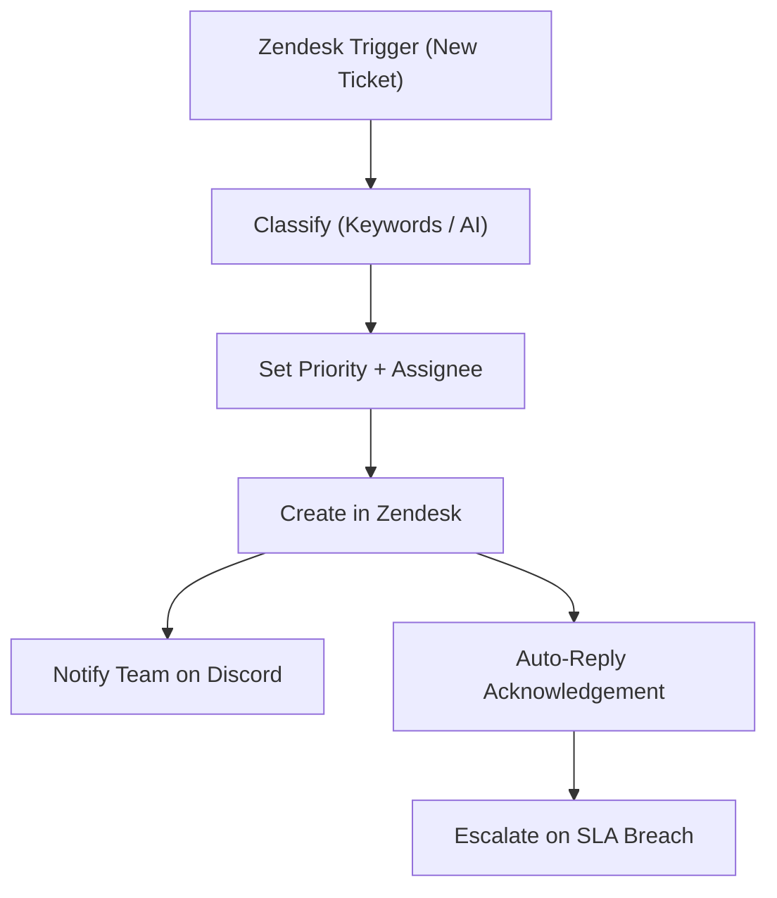

# 13 - Customer Support Ticket Router (Zendesk)

Classifies incoming Zendesk tickets, assigns the right team, sets priority and posts a summary to Discord.

## Architecture Diagram



## Key Nodes

| Node | Purpose |
|------|---------|
| Zendesk Trigger | New/updated ticket |
| Code / IF | Department classification |
| Zendesk | Set fields, assignee |
| Discord (community) | Real-time ticket feed |
| Email | Auto-acknowledgement |
| Cron + IF | SLA escalation check |

## Build & Run

```bash
docker build -t n8n-ticket-router .
docker run -d --name n8n-tickets -p 5678:5678 \
  -v ~/.n8n:/home/node/.n8n n8n-ticket-router
```

Cost: $0 — Zendesk free tier + local automation.
