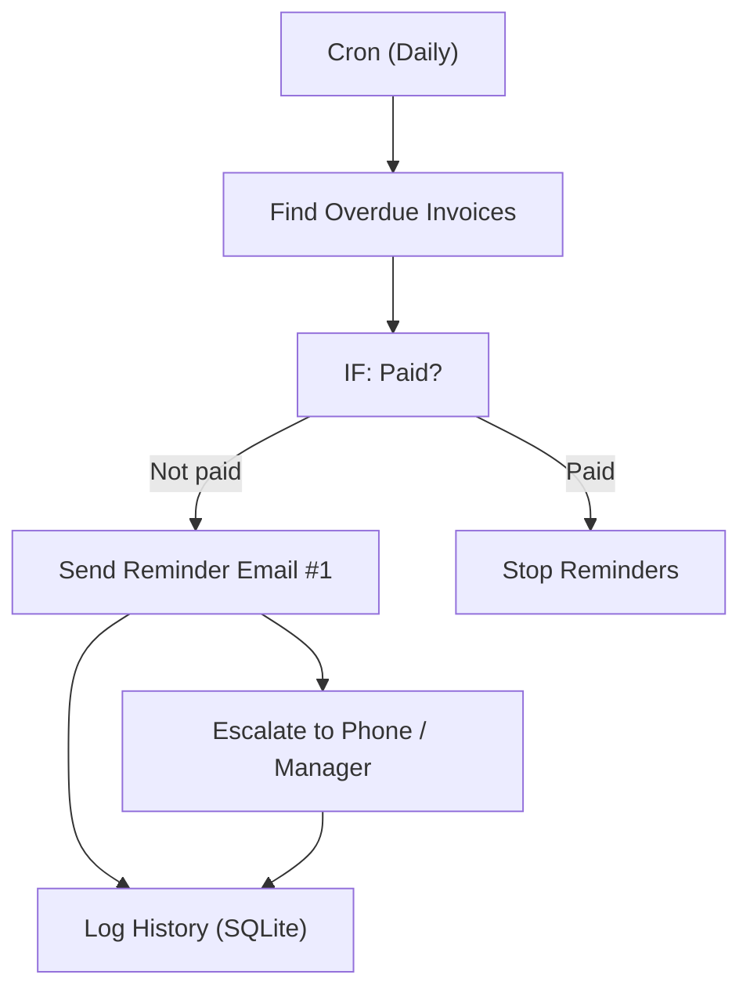

# 14 - Invoice & Payment Reminder Automation

Tracks overdue invoices, sends a polite reminder sequence, escalates after N days and auto-stops once payment is confirmed via Stripe.

## Architecture Diagram



## Key Nodes

| Node | Purpose |
|------|---------|
| Cron Trigger | Daily check |
| Database / Sheet | Overdue invoice list |
| Stripe (community) | Verify live payment status |
| Email | Reminder sequence |
| Code / IF | Escalation logic |
| SQLite (community) | Reminder history |

## Build & Run

```bash
docker build -t n8n-payment-reminders .
docker run -d --name n8n-reminders -p 5678:5678 \
  -v ~/.n8n:/home/node/.n8n n8n-payment-reminders
```

Cost: $0 — free email quotas + local processing.
