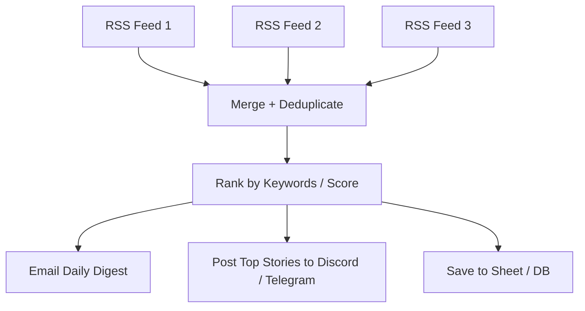

# 15 - RSS News Aggregator & Daily Digest

Polls multiple RSS feeds, deduplicates and ranks articles, then emails a personal digest and posts top stories to Discord/Telegram.

## Architecture Diagram



## Key Nodes

| Node | Purpose |
|------|---------|
| RSS Read | Poll feed URLs |
| Merge | Combine all feeds |
| Code / Filter | Dedup + score |
| Email | Curated digest |
| Discord / Telegram (community) | Post top stories |
| Spreadsheet | Archive history |

## Build & Run

```bash
docker build -t n8n-rss-digest .
docker run -d --name n8n-rss -p 5678:5678 \
  -v ~/.n8n:/home/node/.n8n n8n-rss-digest
```

Cost: $0 — RSS is free, runs entirely locally.
