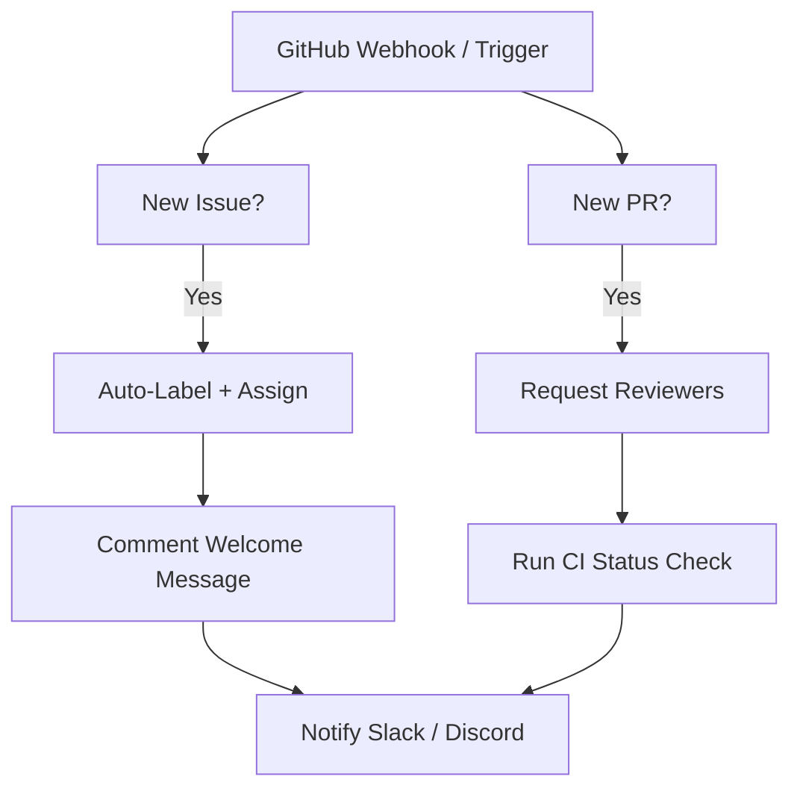

# 16 - GitHub Issue & PR Automation

Watches GitHub issues and PRs, auto-labels, assigns reviewers, posts welcome messages and notifies the team.

## Architecture Diagram



## Key Nodes

| Node | Purpose |
|------|---------|
| Webhook / GitHub Trigger | Event source |
| GitHub (community) | Issues, PRs, labels, reviews |
| IF | Route by event type |
| Code | Label rules |
| Slack / Discord | Team notifications |
| HTTP | Poll CI status |

## Build & Run

```bash
docker build -t n8n-github-workflows .
docker run -d --name n8n-github -p 5678:5678 \
  -v ~/.n8n:/home/node/.n8n n8n-github-workflows
```

Cost: $0 — GitHub free tier (Actions included) + local n8n.
