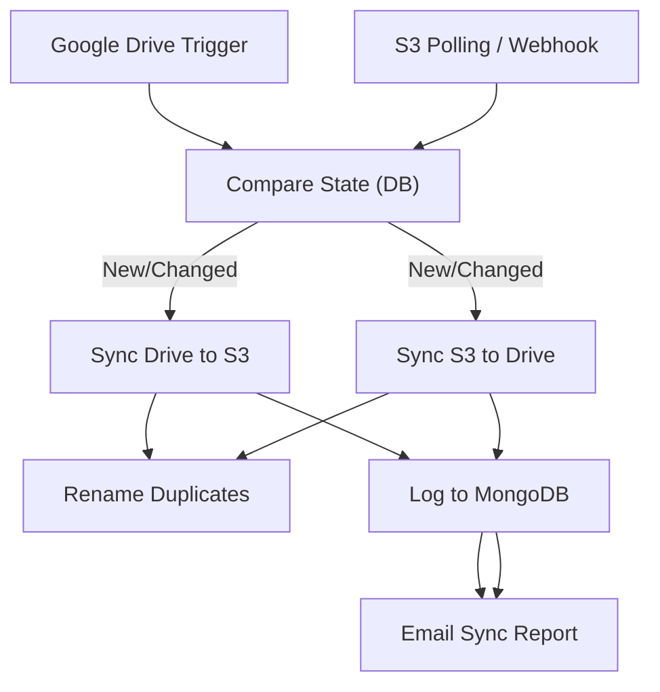

# 17 - Cloud Storage Sync & Backup (Drive / S3)

Watches Google Drive and S3 buckets, syncs changes both ways, deduplicates, logs to MongoDB and emails a sync report.

## Architecture Diagram



## Key Nodes

| Node | Purpose |
|------|---------|
| Google Drive | Watch + read files |
| S3 | Bucket operations |
| MongoDB (community) | Sync state / audit log |
| Code / IF | Conflict resolution |
| Rename | Avoid duplicates |
| Email | Daily sync report |

## Build & Run

```bash
docker build -t n8n-cloud-sync .
docker run -d --name n8n-cloudsync -p 5678:5678 \
  -v ~/.n8n:/home/node/.n8n n8n-cloud-sync
```

Cost: $0 — Google Drive free 15GB, MinIO/S3-compatible local storage.
