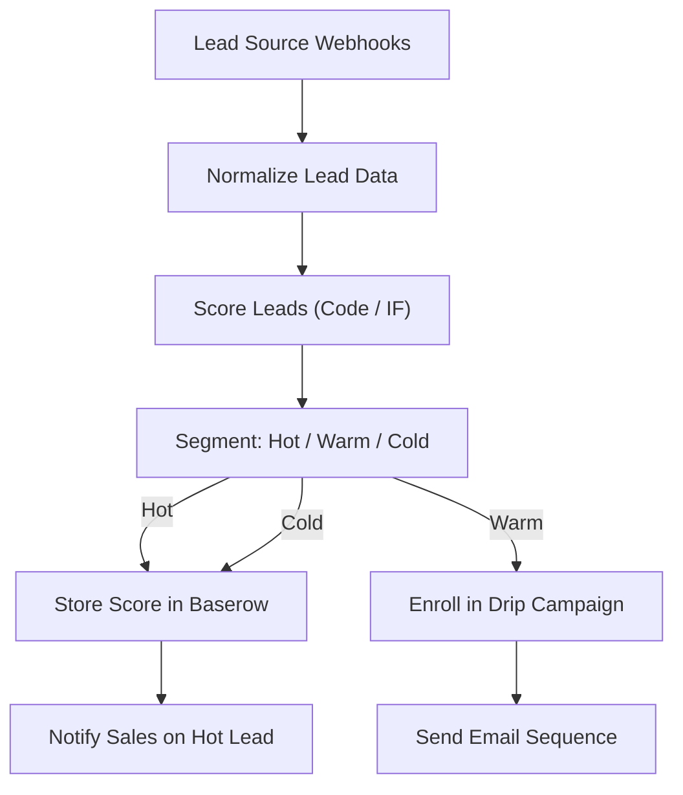

# 18 - Lead Scoring & Drip Email Campaigns

Scores inbound leads, segments hot/warm/cold, enrolls them in drip emails and stores the scoreboard in Baserow.

## Architecture Diagram



## Key Nodes

| Node | Purpose |
|------|---------|
| Webhook | Multiple lead sources |
| Code | Normalize + score |
| IF | Segmentation |
| Baserow (community) | Scoreboard database |
| Email | Drip sequences |
| Slack | Hot-lead alerts |

## Build & Run

```bash
docker build -t n8n-lead-scoring .
docker run -d --name n8n-leadscore -p 5678:5678 \
  -v ~/.n8n:/home/node/.n8n n8n-lead-scoring
```

Cost: $0 — free email quotas + local database.
