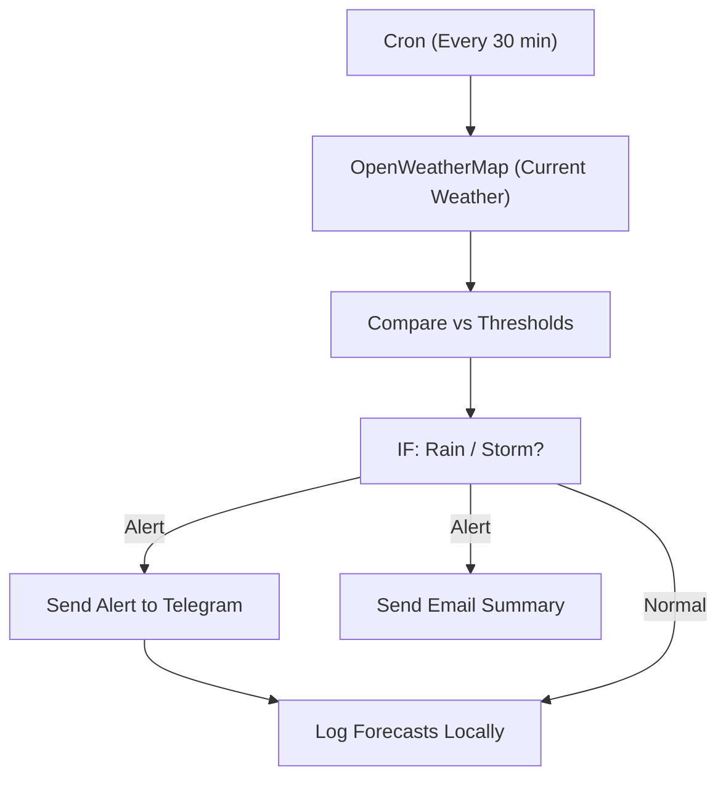

# 19 - Weather Alerts & Smart Notifications

Polls weather for your city, compares against thresholds and sends rain/heat/storm alerts to Telegram, email or Discord.

## Architecture Diagram



## Key Nodes

| Node | Purpose |
|------|---------|
| Cron Trigger | Polling schedule |
| OpenWeatherMap (community) | Live weather data |
| Code / IF | Threshold logic |
| Telegram (community) | Instant alerts |
| Email | Daily weather summary |
| Spreadsheet / DB | Historical log |

## Build & Run

```bash
docker build -t n8n-weather-alerts .
docker run -d --name n8n-weather -p 5678:5678 \
  -v ~/.n8n:/home/node/.n8n n8n-weather-alerts
```

Get a free OpenWeatherMap API key (1000 calls/day free).

Cost: $0 — free weather API tier + local automation.
