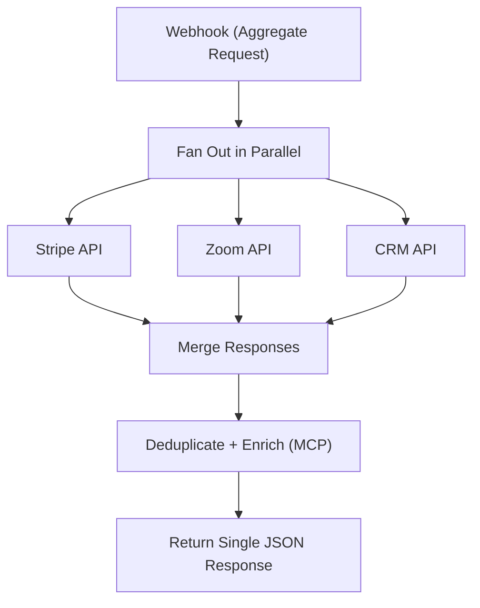

# 20 - Multi-API Aggregation & Enrichment Gateway

One webhook fans out a request to multiple external APIs, merges and deduplicates the responses, enriches via MCP tools and returns one JSON payload.

## Architecture Diagram



## Key Nodes

| Node | Purpose |
|------|---------|
| Webhook | Single entry point |
| Split / Merge | Parallel fan-out |
| HTTP Request | Call external APIs |
| Stripe / Zoom (community) | Ready API modules |
| MCP (community) | Tool-based enrichment |
| Code | Merge + dedupe logic |

## Build & Run

```bash
docker build -t n8n-api-gateway .
docker run -d --name n8n-gateway -p 5678:5678 \
  -v ~/.n8n:/home/node/.n8n n8n-api-gateway
```

Cost: $0 — aggregation logic is local; API quotas depend on your upstream services.
